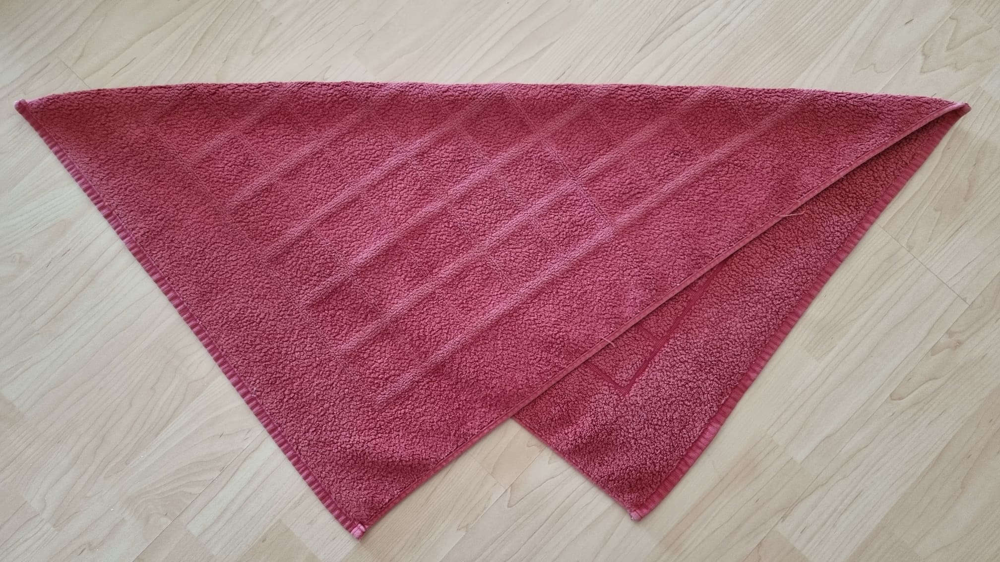
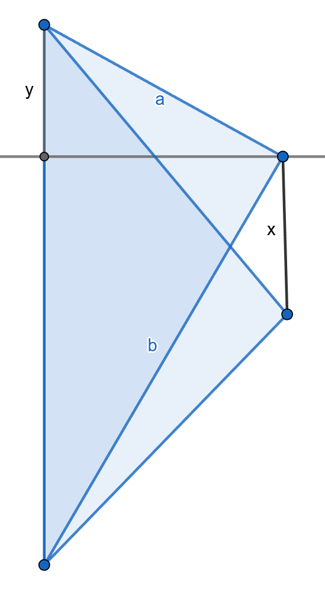
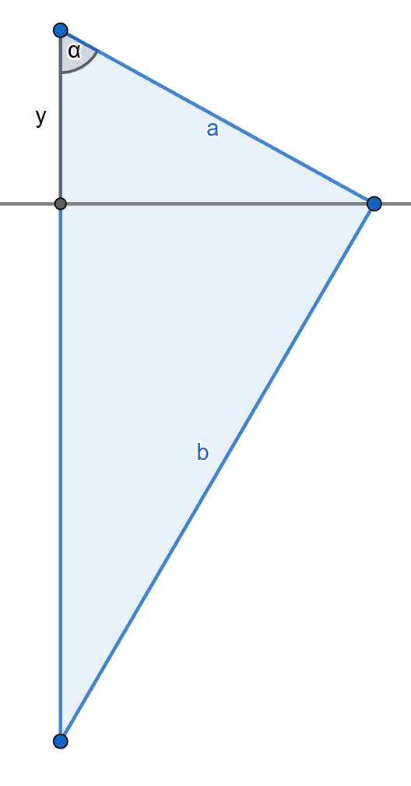

# Distance Between the Tips of a Diagonally Folded Rectangular Towel

## Introduction

When folding a rectangular, crumpled-up towel, you typically take two random corners and pull them together. If you are lucky, you will find the matching corners and can neatly fold the towel. However, sometimes you pick the diagonal corners, resulting in a W-shaped fold.



If you are like me, you might wonder, "How far apart are the two remaining tips?".  This page will answer that question, giving you peace of mind.


## Theorem

For a given rectangular Towel with a width of $`a > 0`$ and heigth of $`b > 0`$, where $`b>a`$, the distance of the two tips, when folded diagonally, is

```math
\sqrt{a^2+b^2} - 2 \frac{a^2}{\sqrt{a^2+b^2}}
```


## Proof

The geometrical representation of the towel is shown in the followin picture



To proof the theorem, we want to calculate the length marked as $`x`$ in the diagram.

We already know that the diagonal has a length of $`d=\sqrt{a^2+b^2}`$.  As the folded towel is symmatrical, we observe, that

```math
x = d - 2y
```

With that we can focus on only one triangle:




The small and the big triangle both share the same angle $`\alpha`$.  As all triangles are right triangles, it follows

```math
\cos\alpha = \frac{y}{a} = \frac{a}{d}
\implies y = \frac{a^2}{d}
```

Combine all, we get the theorem:

```math
x = d - 2y = d - 2 \frac{a^2}{d} = \sqrt{a^2+b^2} - 2 \frac{a^2}{\sqrt{a^2+b^2}}
```

## Credits
* Towel picture made by myself
* Diagrams made with [GeoGebra](https://www.geogebra.org/)
